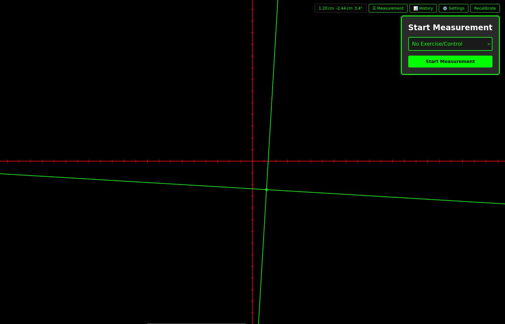
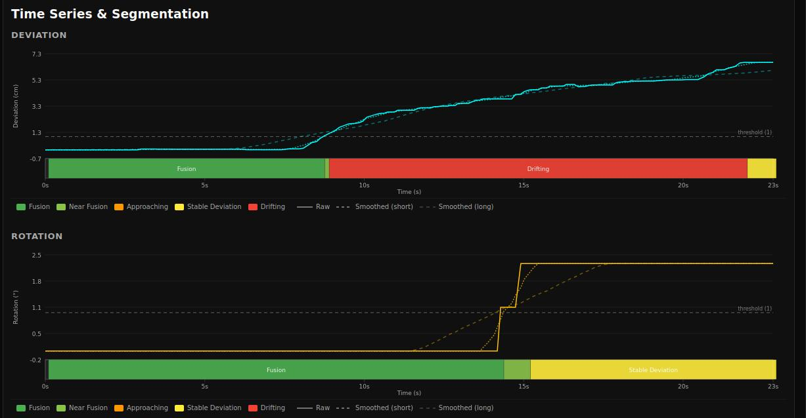
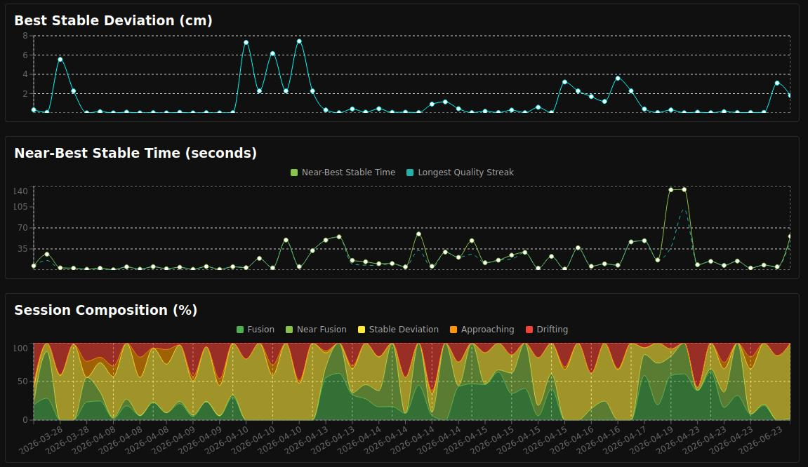

# Strabismus Measurement App

**[Open the App](https://michalfapso.github.io/strabismus-measurement-app/)**

Strabismus is a condition where the eyes do not align properly, causing one or both eyes to turn in, out, up, or down — affecting depth perception and sometimes causing double vision.

---

## Who Is This For?

This tool is designed for **orthoptists, ophthalmologists, and patients** tracking strabismus treatment progress through vision therapy exercises. It provides an objective, timestamped record of how well the eyes are achieving binocular fusion during each session — turning subjective patient reports into measurable data.

---

## What It Measures

During each exercise session, you manipulate an on-screen cross to match your perceived eye position. The app records:

| Metric | Unit | Meaning |
|---|---|---|
| **Deviation** | cm | Primary measure — distance from perfect alignment (√x²+y²) |
| **X** | cm | Horizontal misalignment |
| **Y** | cm | Vertical misalignment |
| **Rotation** | ° | Cyclotorsion (eye rotation) |

After stopping a session you immediately see time-series graphs, histograms, and a segmented breakdown showing how long the eyes spent fused, approaching fusion, or drifting.

---

## Supported Exercises

- Pencil Push-ups
- Brock String
- Extreme Rotation
- Convergence Jumps
- Left / Right Tendon Stretch
- No Exercise / Control
- Custom free-text tags

---

## How to Use

1. **First use — Calibrate:** On the Measurement screen, tap the calibration button and follow the on-screen instructions (hold a credit card or A4 sheet against your screen to set the pixel-per-cm scale).
2. **Record a session:** Select an exercise type, press **Start**, perform the exercise while keeping the on-screen cross aligned with your perception, then press **Stop & Save**.
3. **Review results:** Go to **History**, click any session to see full analysis: time-series graph, histogram, and segmented state breakdown.
4. **Compare sessions:** Shift+click multiple sessions to overlay them and view trends over time — useful for tracking improvement across weeks of therapy.

---

## Screenshots

Measurement showing green and red cross. The red cross is moved and rotated using mouse and scroll wheel:



Single measurement session analysis:



Multiple measurement sessions analysis:



---

## Privacy

All data is stored **locally in your browser** (IndexedDB + localStorage). Nothing is sent to any server. The app works fully offline after the first load.

---

## For Developers

Built with React · TypeScript · Vite · emotion · recharts · react-konva. See [`CLAUDE.md`](CLAUDE.md) and the [`docs/`](docs/) folder for architecture details.

```bash
npm install
npm run dev      # Dev server
npm run build    # Production build
```
